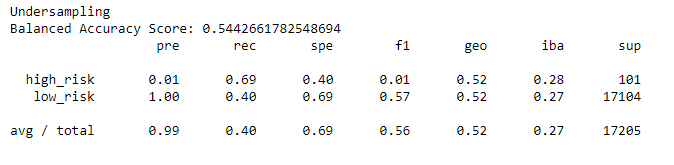
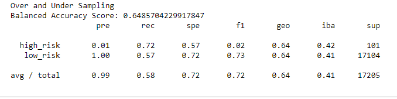
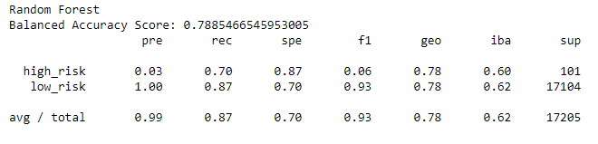
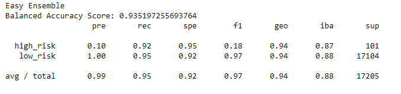

# Credit_Risk_Analysis

## Overview
The purpose of this analysis is to use Supervised Machine Learning to evaluate data related to credit risk. The data identifies customers as high or low risk for loans. Machine Learning is used to develop a method to help predict if future customers are likely to be high or low risk for loans. Logistic regression is used to develop equations based on the data. However, since there is only a small amount of low risk customers in the data set different methods are used to try to account for this. Four different sampling methods are used to account for this, and then a logistic regression is used after the sampling. Then two different ensemble methods are used. To evaluate each method, the accuracy, precision, and recall scores are evaluated.

The data is loaded and split into targets and features. Then the strings are converted using get_dummies. Next, the data is split into a training and testing set. The training set is used to calculate the method. Then it is checked using the testing set. The balanced accuracy, precision, and recall scores show how well the method correctly predicted the credit risk of the testing set.

## Results
The list below lists the Balanced Accuracy, Precision, and Recall scores for each of the 6 methods used. The balanced accuracy score gives the overall percent of how well the method predicted the actual result. The precision score is the percent of correctly identified "high-risk" customers out of all the customers the model predicted as low risk. The recall score is the percent of correctly identified "high-risk" customers out of all the actual "high-risk" customers.

### Random Over Sampler

* Balanced Accuracy score: 0.648
* Precision Score: 0.01
* Recall Score: 0.69

### SMOTE Over Sampler

* Balanced Accuracy score: 0.663
* Precision Score: .01
* Recall Score: 0.63

### Cluster Centroids Under Sampler

* Balanced Accuracy score: 0.544
* Precision Score: 0.01
* Recall Score: 0.69

### SMOTEENN Over and Under Sampler

* Balanced Accuracy score: 0.649
* Precision Score: 0.01
* Recall Score: 0.72

### Balanced Random Forest Classifier

* Balanced Accuracy score: 0.789
* Precision Score: 0.03
* Recall Score: 0.70

### Easy Ensemble AdaBoost Classifier

* Balanced Accuracy score: 0.935
* Precision Score: 0.10
* Recall Score: 0.92

## Summary
The resampling methods had lower scores than the ensemble methods. The resampling methods all had precision score of .01. Meaning of all the customers the model predicted as high risk, only 1 % were actually high risk. The recall scores had a little more variation, but they were in a similar range with SMOTE having the lowest score of 0.63 and SMOTEENN had the highest at 0.72. Undersampling had the lowest accuracy score of 0.54, and SMOTE had the highest at 0.663.

The ensemble methods had higher accuracy scores 0.789 and 0.935 for Random Forest and Easy Ensemble respectively. The precision scores were also higher, 0.03 and 0.10. The Easy Ensemble method had the highest Recall score at 0.92.

The recall score is the most important to detecting risky loans since that helps to ensure that the method would detect a high percent of the actual high risk customers. The Easy Ensemble method had the highest recall score of all the methods tested indicating that this method detected 92% of all actual high risk customers. This method also had the highest precision score, but it is still low at 0.10. This indicates that out of all the customers the method identifies as high risk only 10% actually are. While this would help prevent high risk loans, it may screen out too many applicants.

Based on this analysis I would recommend using the easy ensemble method. This should detect approximately 92% of high risk loans. It will over sceen, but this only accounts for approximately 5% of low risk loans.