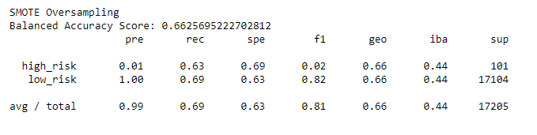

# Credit_Risk_Analysis

## Overview
The purpose of this analysis is to use Supervised Machine Learning to evaluate data related to credit risk. The data identifies customers as high or low risk for loans. Machine Learning is used to develop a method to help predict if future customers are likely to be high or low risk for loans. Logistic regression is used to develop equations based on the data. However, since there is only a small amount of low risk customers in the data set different methods are used to try to account for this. Four different sampling methods are used to account for this, and then a logistic regression is used after the sampling. Then two different ensemble methods are used. To evaluate each method, the accuracy, precision, and recall scores are evaluated.

The data is loaded and split into targets and features. Then the strings are converted using get_dummies. Next, the data is split into a training and testing set. The training set is used to calculate the method. Then it is checked using the testing set. The balanced accuracy, precision, and recall scores show how well the method correctly predicted the credit risk of the testing set.

## Results
The list below lists the Balanced Accuracy, Precision, and Recall scores for each of the 6 methods used. The balanced accuracy score gives the overall percent of how well the method predicted the actual result. The precision score is the percent of correctly identified "high-risk" customers out of all the customers the model predicted as low risk. The recall score is the percent of correctly identified "high-risk" customers out of all the actual "high-risk" customers.

### Random Over Sampler

* Balanced Accuracy score: 0.648
* Precision Score: 0.01
* Recall Score: 0.69

### SMOTE Over Sampler

* Balanced Accuracy score: 0.663
* Precision Score: .01
* Recall Score: 0.63

### Cluster Centroids Under Sampler

* Balanced Accuracy score
* Precision Score
* Recall Score

### SMOTEENN Over and Under Sampler

* Balanced Accuracy score
* Precision Score
* Recall Score

### Balanced Random Forest Classifier

* Balanced Accuracy score
* Precision Score
* Recall Score

### Easy Ensemble AdaBoost Classifier

* Balanced Accuracy score
* Precision Score
* Recall Score

## Summary
Summary: Summarize the results of the machine learning models, and include a recommendation on the model to use, if any. If you do not recommend any of the models, justify your reasoning.